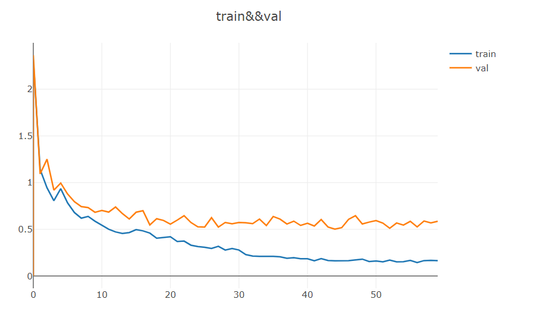
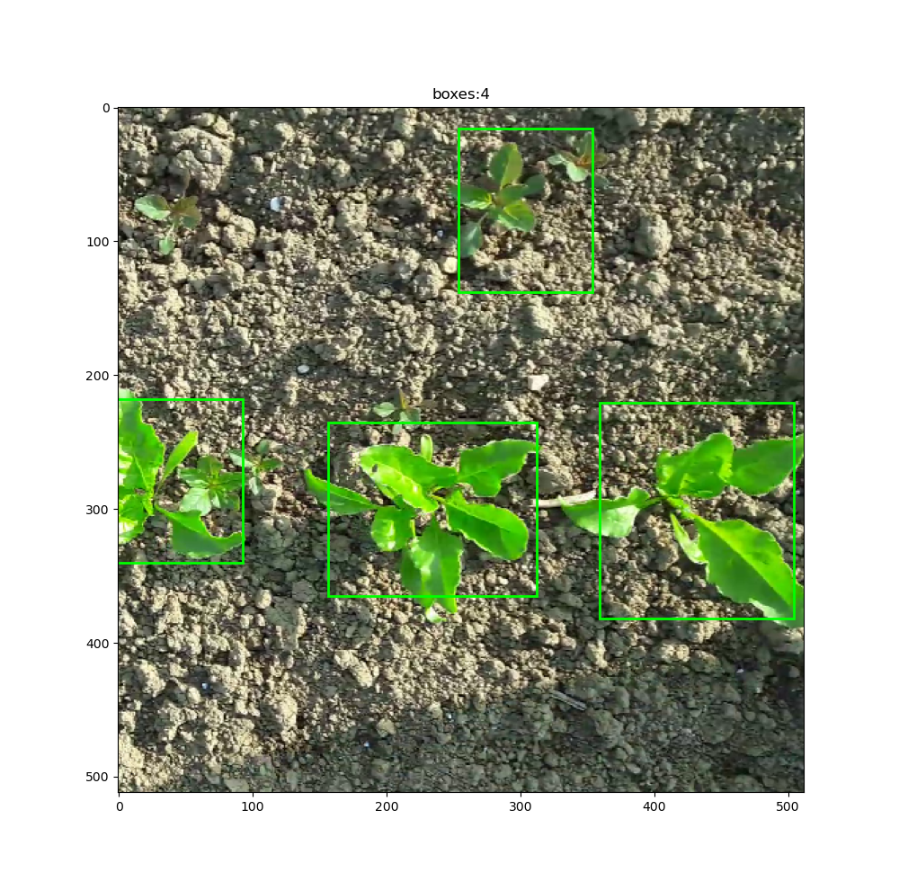

# yolo
这是我的一个object detection project。与目标检测和回归问题不同，object detection在数据集的构建以及Loss的计算上需要花费大量的力气而且需要细心。object detection的代码量远超过与classification和regression。构建如此大项目需要我们细心和专注。构建dataset时，我们需要解析xml文件，使得其返回图像及其对应的groundtruebox。之后，我们还需要再将groundtruebox映射到与neural network的output的同一空间之中。在这里涉及到了坐标转换以及iou计算。object detection的loss function是一个复杂lossfunction。它并不是由单一的loss function组成，而是由多个loss function复合而成。这其中包含了坐标损失，类别损失以及object loss。其中较难的实现的是object loss。至今，我还没完全理解其nonobject loss的原理。在推理过程中，模型的输出同样需要经过一系列复杂的处理才能够转换为groundtruebox。
# learning cure

# detection result

